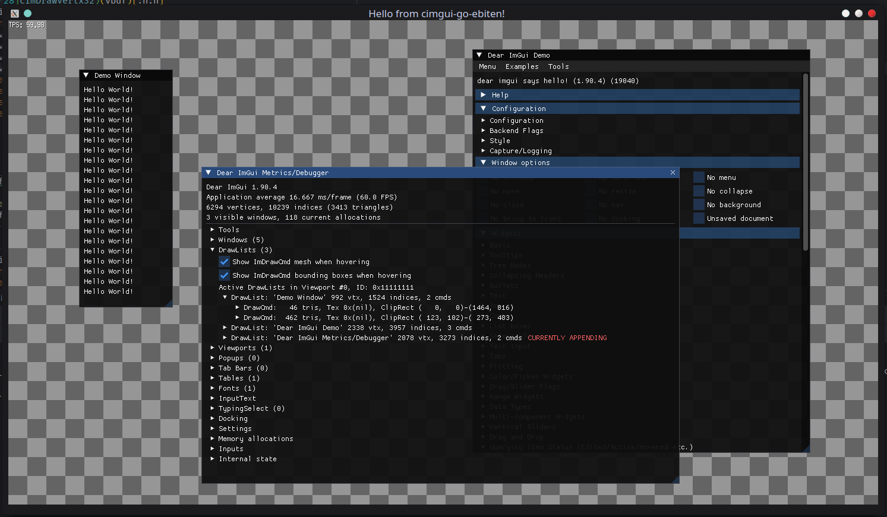

# cimgui-go-ebiten
[Ebiten](https://ebitengine.org/) backend for [cimgui-go](https://github.com/AllenDang/cimgui-go)!



*This is a work in progress!*

Credit for rendering code goes to https://github.com/gabstv/ebiten-imgui. Unfortunately the ebiten-imgui repository hasn't been updated in a while and the version of imgui is forked and outdated. This implementation uses the new backend abstraction to allow it to work with the latest versions of imgui, from the cimgui-go repository. 


## Important!
You MUST use the following buildtags when building.
* exclude_cimgui_sdli
* exclude_cimgui_glfw

```
go run -tags exclude_cimgui_glfw,exclude_cimgui_sdli examples/basic/main.go
```
*Failure to do so will result in a number of ld failures. Ebiten has it's own GLFW 
implementation that conflicts with vanilla cimgui-go*
